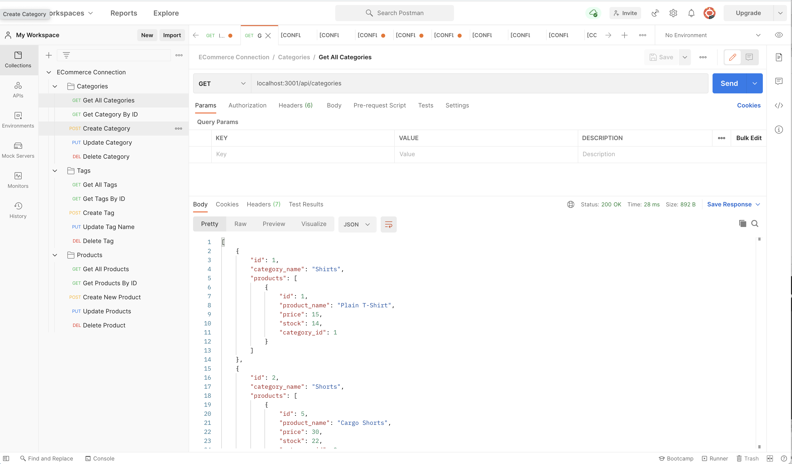

# ECommerce Connector
An Express application utilizing Sequelize to create e-commerce back end technologies.


## Description

The back end portion of an e-commerce website. It allows the user to retrieve records from the database and find products, categories, and tags that are available on the website.

## Table of Contents

* [Reference](#reference)
* [Details](#details)
* [Technologies](#technologies)
* [Installation](#installation)
* [Usage](#usage)
* [License](#license)
* [Contributing](#contributing)
* [Questions](#questions)
  
## Reference

  Click [here](https://drive.google.com/file/d/1FZu6yVLPjYVlF4r5Y6LHVxAmLZHLzuRk/view) to view a walkthrough of the application.

  Sample of Postman organization.
  


## Details
  * Open your command line at the root and open your MySQL shell. enter 'source' and the path to '/db/schema.sql'.
  * Exit MySQL shell and navigate to the ECommerce Connector folder. Run 'npm run seed' to fill the database with pre-existing records.
  * Run npm install to install all necessary packages and modules.
  * Run npm start to begin the application.
  * Navigate to Postman or your chosen platform to run the routes. You can: 
    * GET categories, products, and tags.
    * GET categories, products, and tags by ID.
    * POST to create categories, products, and tags.
    * PUT to update categories, products, and tags.
    * DELETE categories, products, and tags by ID.

## Technologies
Technologies used: JavaScript, MySQL, Inquirer, Sequelize, Express, dotenv

## Installation

To install all necessary materials for this project, run the following command:

```
npm install
```

## Usage

Before using, locally create your database by opening MySQL in your shell, and running the following command:
```
source /(insertpath)/schema.sql
```

Then exit the MySQL shell and run the following command to seed the database

```
npm run seed
```

Be sure to install all node modules and packages locally before using the application, and to create a .env with your information.

## License

This application is protected under the MIT license.

For more information, visit this link: [MIT Info](https://opensource.org/licenses/MIT)

## Contributing
Table layout may be changed to the contributors needs and taste.

## Questions

If you have any questions, please reach out.
* GitHub: [AHFotis](https://github.com/AHFotis)
* Email: annahickey2@gmail.com